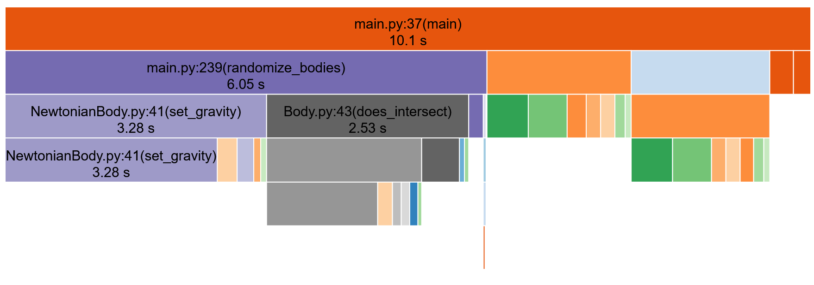

## Description

A 3D Newtonian N-body simulation built in Python. This project uses VTK to render a randomly generated system of celestial bodies, visualizing their initial velocity vectors and the resulting gravitational pull between them.

## Installation & Setup

**1. Set up a virtual environment (Recommended)**

```bash
python -m venv .venv

# On Windows:
.venv\Scripts\activate
# On macOS/Linux:
source .venv/bin/activate
```

**2. Install the required dependencies**

```bash
pip install vtk numpy
```

**3. Run the simulation**

```bash
python src/main.py
```

### System Defaults

- Unit of Mass = 1 solar mass (1.988,416 \* 10^30 kg)
- Unit of Distance = 1 Astronomical Unit (149,597,870,700 meters)
- Unit of Time = 1 Day (86,400 seconds)

### Derived Constants From Defaults

- Unit of Energy = [(Solar mass) * (AU)^2 ] / (Day)^2
- Gravitational Constant = 0.000295913120346

## Notes & Limitations

This is a basic 3D simulation of a static Newtonian N-body system. It uses VTK to render the bodies and map out the physics—the red arrows show the initial velocity vectors, and the blue arrows show the calculated gravitational pull.

The math works, but the code right now is pretty brute-force and leaves a lot of room for optimization. The SnakeViz profile below shows exactly where the program gets bogged down:

- Setup Bottleneck: Just randomizing the bodies' starting locations without them overlapping takes way too long. The more bodies you cram into the bounding box, the worse the delay gets.
- Gravity Calculations (O(N^2)): Calculating the gravity between every single pair of bodies using nested Python loops is a massive performance hit.

**Next Steps for Optimization:**

- **NumPy Vectorization:** Swap out the slow iterative Python loops in `set_gravity()` and `get_system_potential()` with NumPy vector operations to speed up the math.
- **Spatial Partitioning:** Look into adding an Octree or using Barnes-Hut. Right now, checking every single body against every other body for collisions and gravity is O(N^2). Dropping that down to O(N log N) would let the program handle way more bodies efficiently.

## Performance Profiling



| Calls     | Total Time (s) | Per Call (s) | Cum. Time (s) | Function                 | File Location                    |
| :-------- | :------------- | :----------- | :------------ | :----------------------- | :------------------------------- |
| 1,000     | 2.659          | 0.003        | 3.278         | `set_gravity()`          | `src/bodies/NewtonianBody.py:41` |
| 2         | 1.977          | 0.989        | 3.548         | `get_system_potential()` | `src/bodies/NewtonianBody.py:79` |
| 586,541   | 1.392          | 0.000        | 1.945         | `distance_squared()`     | `src/bodies/Body.py:30`          |
| 6,755,623 | 0.615          | 0.000        | 0.615         | `get_position()`         | `src/bodies/Body.py:23`          |
| 1,001,000 | 0.520          | 0.000        | 0.520         | `add_vecs()`             | `src/support/vector_math.py:3`   |
| 1,001,000 | 0.488          | 0.000        | 0.488         | `scale_vec()`            | `src/support/vector_math.py:6`   |
| 586,541   | 0.472          | 0.000        | 2.534         | `does_intersect()`       | `src/bodies/Body.py:43`          |
| 1         | 0.295          | 0.295        | 10.119        | `main()`                 | `src/main.py:37`                 |
| 2,997,000 | 0.268          | 0.000        | 0.268         | `get_mass()`             | `src/bodies/NewtonianBody.py:35` |
| 3,194,679 | 0.234          | 0.000        | 0.234         | `isinstance()`           | `[built-in]`                     |
